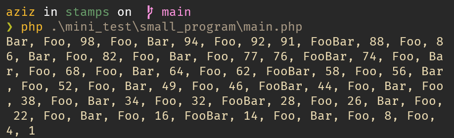
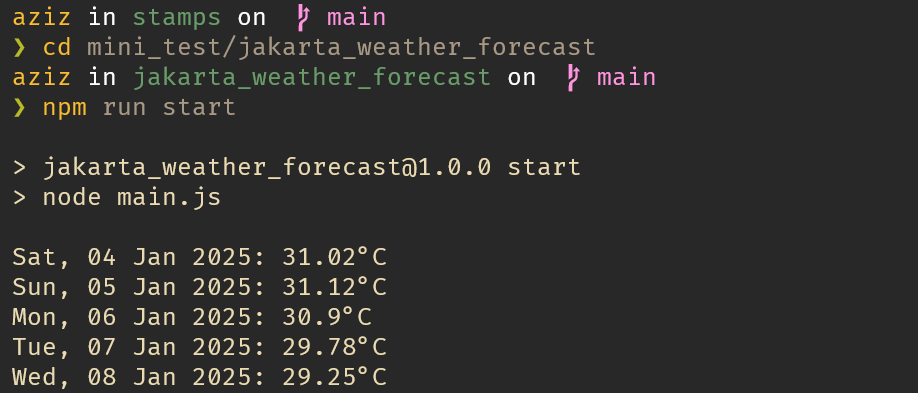

# Stamps Mini Test

## Small Program



- Pindah ke direktori small_program

    ```bash
    cd mini_test/small_program
    ```

- Gunakan PHP versi 7 ke atas untuk menjalankan program

    ```bash
    php main.php
    ```

## Jakarta Weather Forecast



- Pindah ke direktori jakarta_weather_forecasst

    ```bash
    cd mini_test/jakarta_weather_forecast
    ```

- Install dependensi yang dibutuhkan

    ```bash
    npm install
    ```

- Copy file .env.example

    ```bash
    cp .env.example .env
    ```

- Isi `OPENWEATHER_API_KEY` pada file .env
- Jalankan program

    ```bash
    npm run start
    ```
